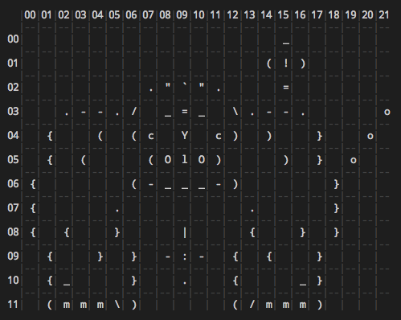

# Gosay

Similar to cowsay but a little cooler.

## Install

```sh
$ npm install gosay -s
```

You can install Gosay globally if you wish to checkout the CLI. This will add "gosay" to your path.

```sh
$ npm install gosay -g
```

## Quick Start

```ts
import { Gosay } from 'gosay';
const gosay = new Gosay();
const template =
  '    ^__^               \n' +
  '\\  (oo)\\_______      \n' +
  ' \\ (__)\\       )\\/\\\n' +
  '         ||----w |      \n' +
  '         ||     ||        ';

// Sets border for message box as blue
// with text box positioned to the left
// of Goticon or ASCII art.
gosay.say('YOUR_TEXT_HERE', template, { positionX: 'left', borderStyle: 'blue' });
```

CREDIT: Where'd we get the cow example? Right here >> [cowsay](https://github.com/piuccio/cowsay)

The result from our quick start will look similar to the following.


NOTE: For colorizing ASCII art you may wish to use an instance of Goticon [see below](#Goticon).

## Options

<table>
  <thead>
    <tr><th>Property</th><th>Description</th><th>Default</th></tr>
  </thead>
  <tbody>
    <tr><td>goticon</td><td>ASCII artwork string.</td><td>undefined</td></tr>
    <tr><td>directory</td><td>Directory where Goticons are stored.</td><td>./goticons</td></tr>
    <tr><td>width</td><td>The width of the message box.</td><td>36</td></tr>
    <tr><td>padding</td><td>The message box padding in spaces left/right of text.</td><td>2</td></tr>
    <tr><td>align</td><td>The message box text alignment left or center.</td><td>center</td></tr>
    <tr><td>positionX</td><td>The horizontal position of msg box left or right.</td><td>right</td></tr>
    <tr><td>positionY</td><td>The vert position of msg box top, middle or bottom.</td><td>middle</td></tr>
    <tr><td>gutter</td><td>The number in spaces between message box and ASCII art.</td><td>2</td></tr>
    <tr><td>border</td><td>Border style single, double, round, single-double, double-single or classic.</td><td>round</td></tr>
    <tr><td>borderStyle</td><td>String or array of ANSI colors/styles.</td><td>undefined</td></tr>
    <tr><td>wrapper</td><td>A character to wrap output with.</td><td>\n or \r\n</td></tr>
    <tr><td>colorize</td><td>Whether or not to colorize.</td><td>true</td></tr>
  </tbody>
</table>

## CLI

A very simple CLI for is included for checking out Gosay. If you have installed Gosay globally just type "gosay" from your terminal and help will be displayed. Alternatively you can type "./node_modules/gosay/bin/cli" if Gosay is installed in your project as a dependency.

**Hello World**

```sh
$ gosay 'Hello World'
```

**Display Help**

```sh
$ gosay --help
```

## Goticon

Helper method to assist in managing art. A Goticon allows you to plot ASCII artwork specifying elements that may be replaced or colorized. Colorizing ASCII art can be a pain and looks a mess. It's also difficult to make changes. Goticons makes this a little easier with a tiny bit of up front work.

```ts
const cow = gosay.goticon('cow', template);   // create cow Goticon using our earlier template.
cow                                           // create element on cow.
  .element('eyes', [1, 2], 1)
  .styles(null, 'green');
const rendered = cow.render();                // render styled cow.
console.log(rendered);
```

### Conventions

When plotting out your elements you can specify an x and y coordiate or arrays. When specifying arrays it means the element should include points along an axis.


```ts
cow.element('element')
  .add(x, y)                        // coord are single values.
  .add([x1, x2], y)                 // x coords contain individual points.
  .add([x1, x2, 'range'], y)        // should select all points in between the two points.
  .add([x1, '*'], y)                // include all points to end of row after x1 point.
  .add(['*', x2], y)                // include all points up to x2.
  .add([x1, x2, 'range'], [y1, y2, 'range']) // include x & y ranges (for ex: like a box).
```

### Plotting & Rendering

In order to define your elements you'll probably need to get the plotting grid. This will assist in visually seeing x and y coordinates for your elements. The general idea is to get the horizontal points or range of points along a row or the y coordinate. An element can consist of multiple points along multiple rows. This allows for easy styling and theming.

It is often advantageous to output the current render along with the plot until you've achieved the desired result. Once done you can save for future use.

```ts
const cow = gosay.goticon('cow', template);   // create cow Goticon using our static template above.
cow                                           // create element on cow.
  .element('eyes', [1, 2], 1)
  .styles('green');
console.log(cow.render());                    // ouptut to our terminal.
```

**Rendered Result**

<br/>

**Plot Example**

The below is an example of "Gus" the gorilla.

```ts
const gus = gosay.goticon('gus');
console.log(gus.plot('OPTIONAL_THEME'));       // output to terminal.
```

<br/>

## Usage

The above quick start shows creating a Goticon from a static template. You can also import predefined Goticons from a directory in your project. By default this would be a folder in the root of your project called "goticons". You can change this location by changing the "directory" property in your Gosay options.

**Predefined Goticon**

Defines known Goticon that's been imported from default directory path. If your "directory" is <code>./goticons</code> and it contains a file named <code>cow.goticon</code> you could define your Goticon as follows.

```ts
// Returns Goticon with name of cow where path is
// ./goticons/cow.goticon.
const importedCow = gosay.goticon('cow');
```

**Goticon File with Content**

This example is useful when you want to define a Goticon at a specific path other than the default location specified in options using the "directory" property.

```ts
// where "template" is from our quick start ex: above.
const fromFileContentCow = gosay.goticon('cow', template, './some/path/to/cow.goticon');
```

### Complex Elements

When defining elements points may exist on multiple lines. This is possible as Goticons sees each character as a point in a plot of characters.

Here's how you might define the elements for our cow in the example above. Note the head and body where we add additional points from our plot to create the entire element.

```ts
const cow = gosay.goticon('cow', template);

cow
  .element('head', [1, 2], 0)
  .add([0, 3], 1)
  .add([0, 3], 2)
  .styles('magenta');

cow
  .element('ears', [0, 3], 0)
  .styles('magenta');

cow
  .element('body', [4, 11], 1)
  .add(4, 2)
  .add(12, 2)
  .add([6, 9, 'range'], 3)
  .styles('cyan');

cow
  .element('tail', [13, 15, 'range'], 2)
  .styles('magenta');

cow
  .element('utters', 10, 3)
  .styles('magenta');
```

### Themes

Goticons also support themes. By default when you call <code>.style()</code> the style is added to the default theme. If you wish to use a different theme pass that theme or theme name as the second argument.

**Creating a Theme**

```ts
const myTheme = cow.theme('myTheme');
```

**Adding Element Style to Theme**

When adding theme details you pass the element or element name, a replacement value (say you want to replace the eyes or mouth etc) and finally a rest param of styles.

```ts
myTheme.add('tail', null, 'blue');
```

OR

```ts
const tail = cow.element('tail'); // gets our tail element.
myTheme.add(tail, null, 'blue'); // passing reference to element.
```

OR

```ts
const tail = cow.element('tail'); // gets previously created element.
tail.styles('myTheme', 'blue');
```

**Inheriting Themes**

It is important to note each Goticon is created with the "default" theme. For this reason thing of the default thing as your base. You can then inherit from this theme to then create custom or detailed themes where selective elements are shown/hidden, repleaced or styled as needed.

```ts
const myTheme = cow.theme('alt').inherit('smiling');
```

### Saving

Goticons can be saved with their metadat for recreating their elements and styles. This is done by prefixing the .goticon file with YAML.

For example default YAML might look like this:

```yaml
---

# YAML CONFIGURATION: This section contains element and theme
# settings for rendering this Goticon. If you DO NOT wish to
# store configuration settings use .save(false).

name: cow
elements: {}
themes:
  default:
    name: default
    elements: {}

---
```

**Default Save**

The following few examples assume "cow" is a defined Goticon.

```ts
cow.save();
```

**Save Without YAML**

```ts
cow.save(false);
```

**Save to Alternate Path**

Note in this case the second arg is whether or not to include YAML metadata.

```ts
cow.save('./some/new/path/cow.goticon', false);
```

**Save with ANSI Styling**

By default the save Goticon body does not contain the rendered ANSI styled art. To save the Goticon art with ANSI styles call:

Where 'myTheme' is the theme that should be rendered before save. If no theme is provided the 'default' theme is used.

Save Rendered optionally accepts the theme, path and config flag to include/exclude YAML.

```ts
cow.saveRendered('myTheme');
```

## Change

See [CHANGE.md](CHANGE.md)

## License

See [LICENSE.md](LICENSE.md)